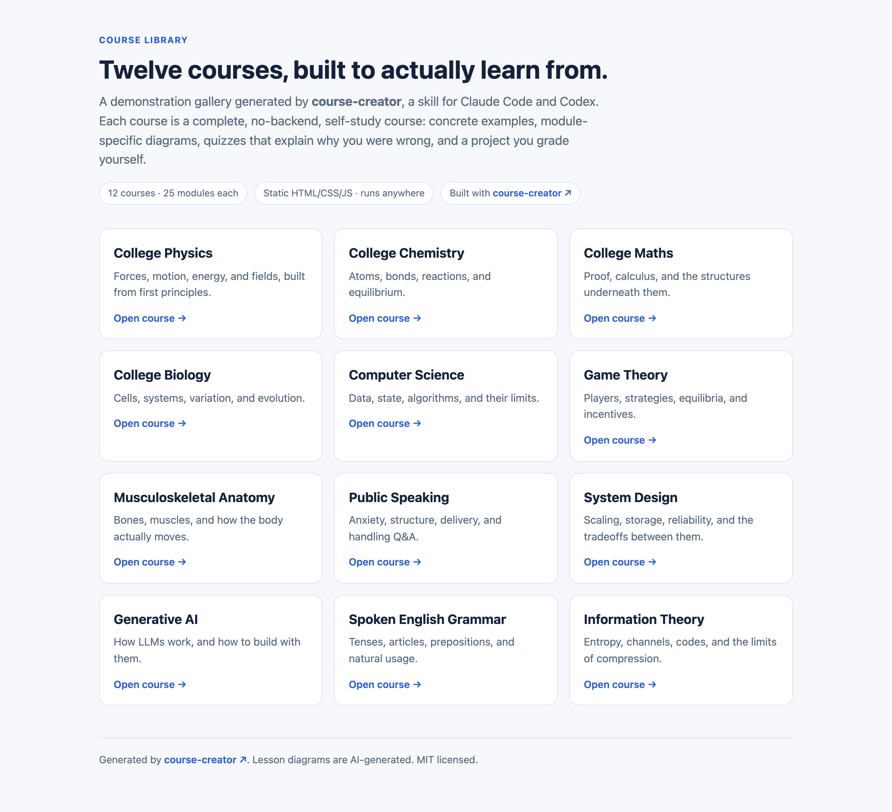
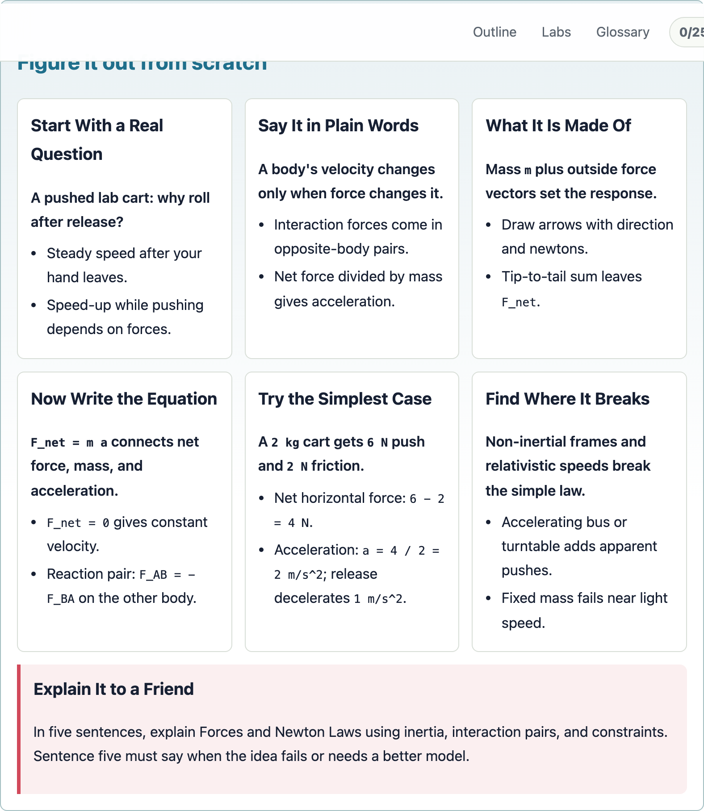
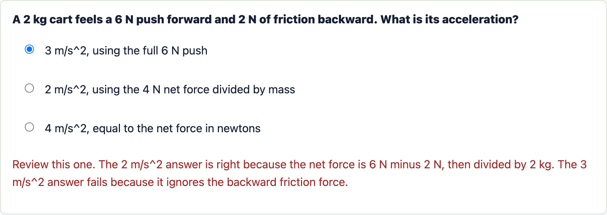
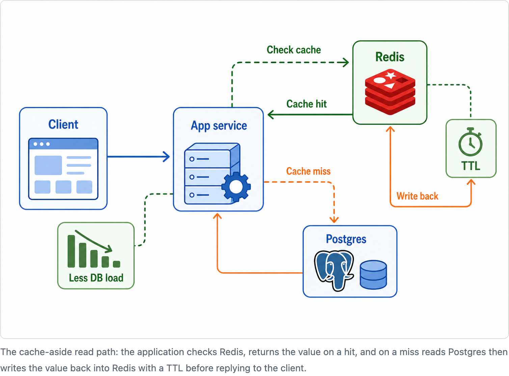

# Course Creator

**A skill for Claude Code and Codex that turns anything you want to learn into a
real course: a path from beginner to advanced, built from first principles, with
hands-on labs and projects, tuned to how you learn.**

*A good answer is not the same as learning something.*

## The problem

Most learning in 2026 goes nowhere. You ask an AI, get a clean answer, and forget
it by morning. You save a blog post you never reopen. You buy a book you never
start. There is no path from knowing nothing to knowing something deeply, no
practice that proves you can use it, and nothing shaped to how you learn. Course
Creator builds that path.

## 12 courses, live now

[Physics](https://shivamgupta42.github.io/course-library/physics/guide/index.html) ·
[Chemistry](https://shivamgupta42.github.io/course-library/chemistry/guide/index.html) ·
[Maths](https://shivamgupta42.github.io/course-library/maths/guide/index.html) ·
[Biology](https://shivamgupta42.github.io/course-library/biology/guide/index.html) ·
[Computer Science](https://shivamgupta42.github.io/course-library/computer-science/guide/index.html) ·
[Game Theory](https://shivamgupta42.github.io/course-library/game-theory/guide/index.html) ·
[Anatomy](https://shivamgupta42.github.io/course-library/anatomy/guide/index.html) ·
[Public Speaking](https://shivamgupta42.github.io/course-library/public-speaking/guide/index.html) ·
[System Design](https://shivamgupta42.github.io/course-library/system-design/guide/index.html) ·
[Generative AI](https://shivamgupta42.github.io/course-library/generative-ai/guide/index.html) ·
[Spoken English Grammar](https://shivamgupta42.github.io/course-library/spoken-english-grammar/guide/index.html) ·
[Information Theory](https://shivamgupta42.github.io/course-library/information-theory/guide/index.html)

**[→ Browse the gallery](https://shivamgupta42.github.io/course-library/)** · open any course, nothing to install.

## What you get

- **A path you finish.** 25 lessons in three tracks, Foundations through Projects and Research. It carries you from beginner to advanced instead of dropping one answer and leaving.
- **You understand, you do not memorize.** Each idea is rebuilt from first principles, Feynman style, then explained back in five plain sentences.
- **You build something every lesson.** A hands-on project ends each lesson, and each course ships interactive labs.
- **It explains your mistakes.** Get a quiz wrong and it tells you which idea you confused and why the right answer wins, instead of just "incorrect."
- **You grade yourself.** Every project comes with a rubric and a pass line, so you know when you have actually got it.
- **It is tuned to you.** Tell it who it is for and how deep to go, and it builds for that.
- **It can bring outside resources.** Ask for a resource library and it adds curated YouTube videos, books, free courses, slide decks, docs, and references mapped to the lessons.

## Inside a lesson

Every idea is rebuilt from scratch, then explained back in your own words:

A quiz that does not just mark you wrong, it tells you which idea you confused:

And a diagram drawn for that one lesson:

## Use it

Drop this folder into `~/.agents/skills/course-creator` (or `.claude/skills/`),
then ask it to build, upgrade, or review a course.

- `SKILL.md` is the workflow
- `references/` holds the contracts
- `assets/diagrams.mjs` draws the diagrams
- `references/resource-library.md` defines the optional YouTube/readings/free-course library

MIT licensed. Contributions welcome: see [CONTRIBUTING.md](CONTRIBUTING.md) and the [Code of Conduct](CODE_OF_CONDUCT.md).
